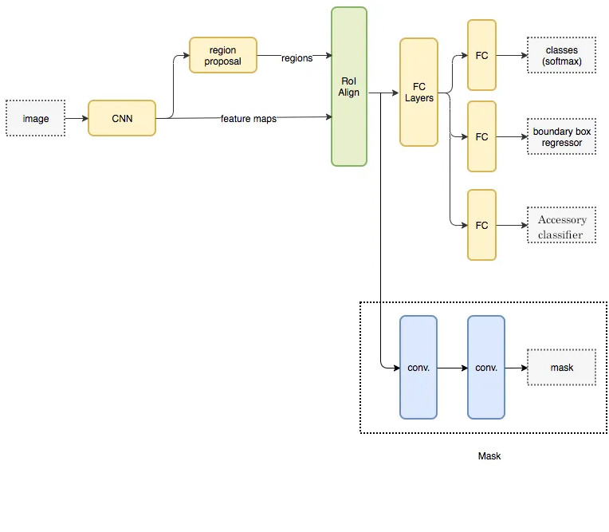

# Instance Segmentation and Object Recognition on Modanet


This is my project for Deep Learning and Generative Models course at @UniPr.
The goal of the project was to train and make some ablation studies with a Mask RCNN on [ModaNet](https://github.com/eBay/modanet) dataset.
Modanet is composed of more than 40k images with dress' annotations.

| Label | Description | Fine-Grained-categories |
| --- | --- | --- |
| 1 | bag | bag |
| 2 | belt | belt |
| 3 | boots | boots |
| 4 | footwear | footwear |
| 5 | outer | coat/jacket/suit/blazers/cardigan/sweater/Jumpsuits/Rompers/vest |
| 6 | dress | dress/t-shirt dress |
| 7 | sunglasses | sunglasses |
| 8 | pants | pants/jeans/leggings |
| 9 | top | top/blouse/t-shirt/shirt |
|10 | shorts | shorts |
|11 | skirt | skirt |
|12 | headwear | headwear |
|13 | scarf & tie | scartf & tie |

The project's task also requires to modify the Mask RCNN's structure by adding new branch in the head of the net, which will be in charge of classify if an object recognized by the net is an accessory or not, based on the following classification:

| Label | Accessory |
| --- | ---  |
| 1 | bag |  
| 2 | belt |
| 7 | sunglasses | 
|12 | headwear | 
|13 | scarf & tie | 

So, the final structure of the model will be something like this:


Here is the structure of the project:
- `main.py`: This module is responsible for launching the simulation and handling args options.
- `solver.py`: This module includes methods for training, validation, test and evaluation. It's the core of the project.
- `models/mask_rcnn.py`: This module create the Mask RCNN model, based on [official PyTorch implementations](https://pytorch.org/vision/main/models/mask_rcnn.html). The model can be selected between two backbone provided by PyTorch. This module also create the FastRCNNPredictorWithAccessory, which can replace the default RCNNPredictor if the accessories classifications is required.
- `models/roi_heads.py`: This module implements a custom RoIHeads for accessory binary classification and a custom fasterrcnn loss with accessories classification 
- `dataset/modanet.py`: This module implements the DataLoader for Modanet dataset. It uses coco annotations.
- `utils/utils.py`: This module contains utils functions, like drawing masks and boxes to an image.
- `test_rt.py`: *Work in progress* module which will be in charge of use webcam and do model's inference on the image captured by the cam.


## Getting Started

All of the modules needed to run the models are in the `requirements.txt` file. I also provide `requirments_used.txt` which specifies also the version of the package, just in case some of you want to replicate my environment.

```shell
pip install -r requirments.txt
```
And then you can clone this repo
```shell
git clone https://github.com/FilippoBotti/Mask_RCNN.git
```

## Download dataset
To download the datasets I suggest you to follow the [offical guide](https://github.com/eBay/modanet/tree/master).
By the way I was in trouble with that instructions so here's another [useful link](https://github.com/kyamagu/paperdoll/issues/11)


## Train from scratch
To see a list of possible args see the corresponding section below.
```shell
python main.py --mode train --model_name modanet_training --dataset_path DATASET_PATH --checkpoint_path CHECKPOINT_PATH --epochs 40 --pretrained False --manual_seed False
```

## Finetuning
I also provide finetuning MaskRCNN with pretrained weights based on [Pytorch's training on Coco dataset](https://pytorch.org/vision/main/_modules/torchvision/models/detection/mask_rcnn.html#MaskRCNN_ResNet50_FPN_Weights)
```shell
python main.py --mode train --model_name modanet --dataset_path DATASET_PATH --checkpoint_path CHECKPOINT_PATH --epochs 40 --pretrained True --manual_seed False
```

## Test 
```shell
python main.py --mode test --model_name modanet --dataset_path DATASET_PATH --checkpoint_path CHECKPOINT_PATH 
```

## Evaluate 
```shell
python main.py --mode evaluate --model_name modanet --dataset_path DATASET_PATH --checkpoint_path CHECKPOINT_PATH 
```
   
## Args
| Parameter           | Description                                                                                                 |
|---------------------|-------------------------------------------------------------------------------------------------------------|
| model_name          | The name of the model to be saved/loaded                                                                     |
| annotations_file    | The name of the annotations file                                                                             |
| epochs              | Number of epochs to train                                                                                   |
| workers             | Number of workers in data loader                                                                            |
| print_every         | Print loss every N iterations                                                                               |
| lr                  | Learning rate                                                                                               |
| opt                 | The optimizer used, which can be SGD or ADAM (better results)                                               |
| dataset_path        | The dataset directory                                                                                       |
| checkpoint_path     | Path where to save the trained model                                                                        |
| resume_train        | Determines if resume train or not                                                                           |
| mode                | The mode of the running, which can be train, test, evaluation, or debug                                     |
| pretrained          | Determines if load pretrained coco's weights or train from scratch                                         |
| version             | Determines the backbone that will be used (V1 or V2)                                                       |
| cls_accessory       | Add accessories classifier to the net                                                                        |
| manual_seed         | Use the same random seed (1) to replicate training results                                                  |
| coco_evaluation     | Use evaluation from COCO standard; if false, Mean Average Precision (mAP) will be used                     |


## Authors

* **Filippo Botti** 

## License

This project is licensed under the MIT License - see the [LICENSE.md](LICENSE.md) file for details

## Acknowledgments
This code is based on [Zheng et al., 2018](#zheng2018acmmm)

## References

- Zheng, S., Yang, F., Kiapour, M. H., & Piramuthu, R. (2018). [ModaNet: A Large-Scale Street Fashion Dataset with Polygon Annotations](#zheng2018acmmm). In ACM Multimedia.
